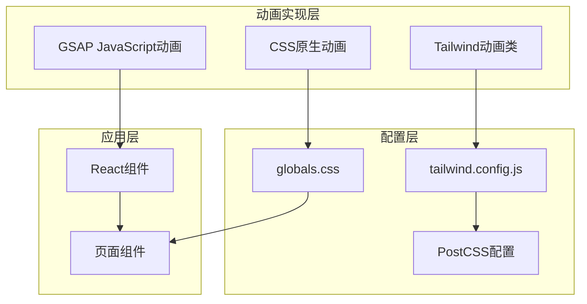
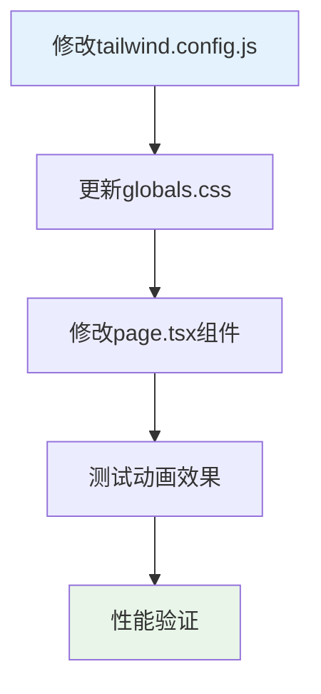
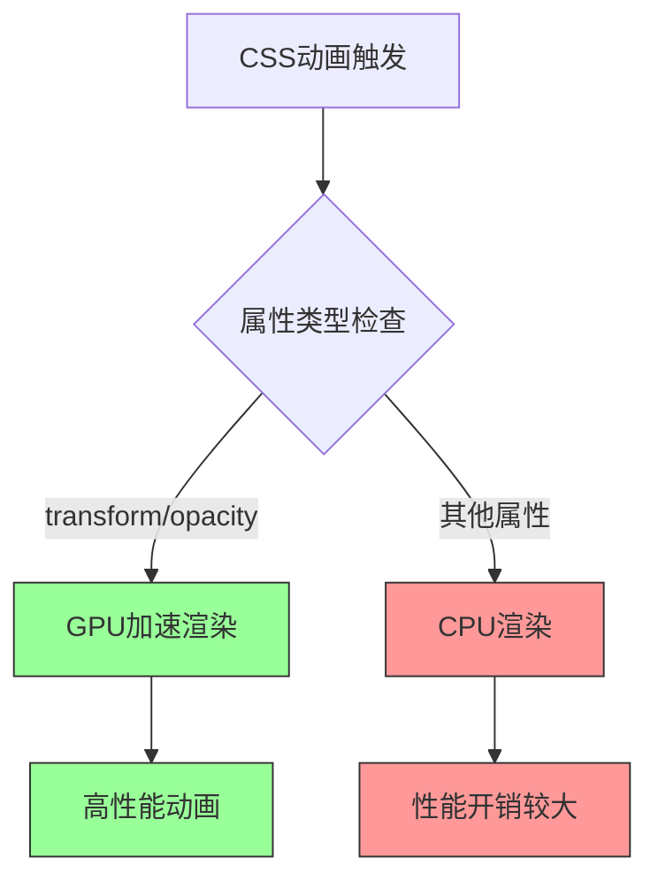
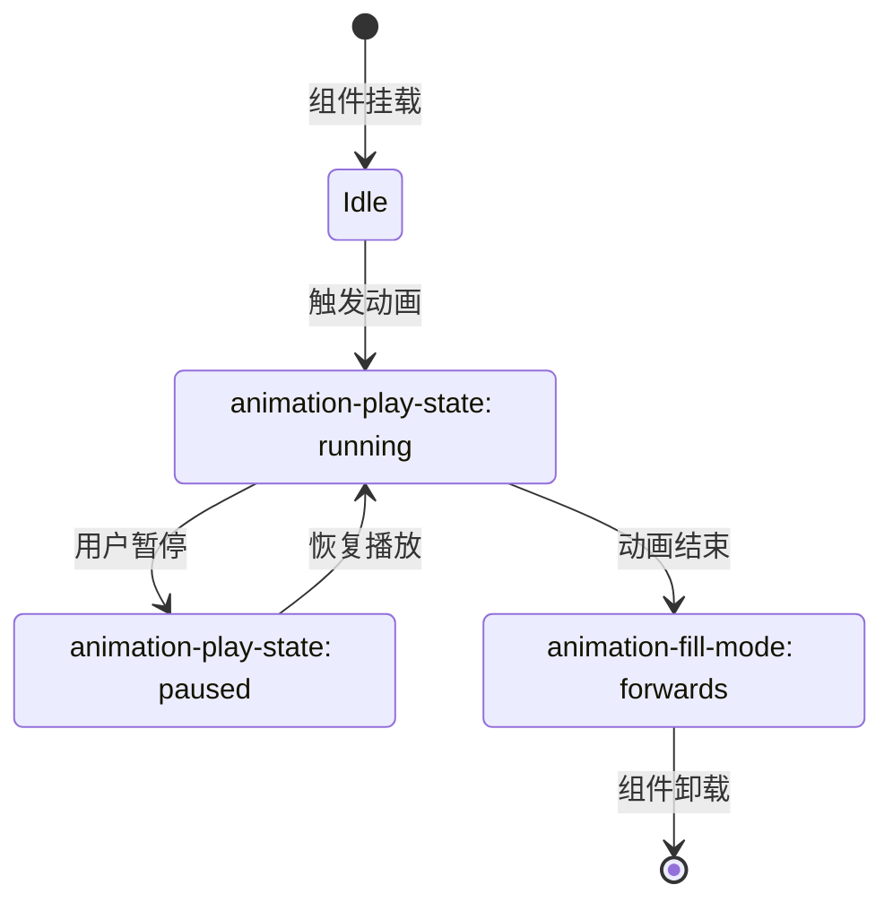
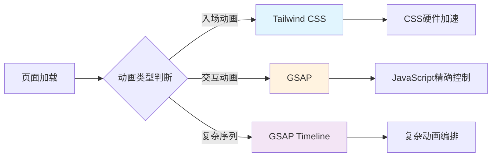
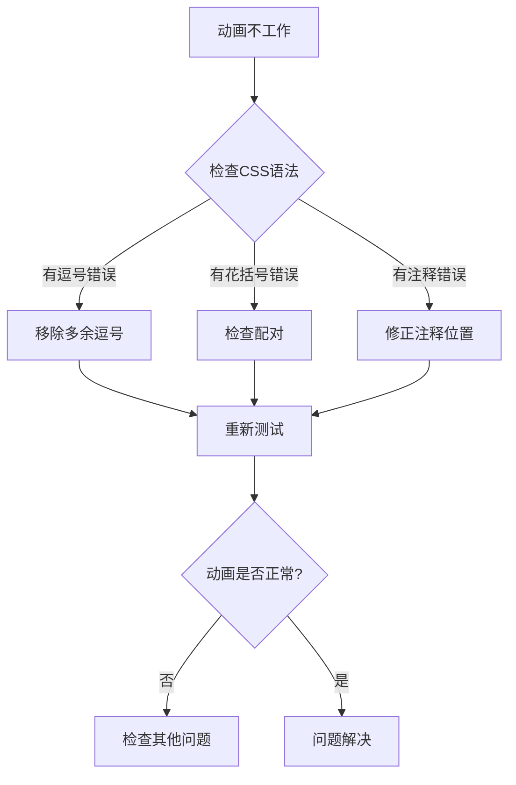

# CSS动画效果设计文档

## 概述

本文档描述了项目中CSS动画效果的设计与实现，重点关注将传统CSS动画转换为Tailwind CSS写法的最佳实践。项目基于Next.js框架，采用混合动画策略：CSS原生动画处理页面加载效果，GSAP处理复杂交互动画。

## 技术架构

### 动画系统架构



### 技术栈选择

| 技术 | 用途 | 优势 |
|------|------|------|
| CSS @keyframes | 基础动画定义 | 性能优异，硬件加速 |
| Tailwind CSS | 动画类生成 | 开发效率高，可配置性强 |
| GSAP | 复杂动画控制 | 精确控制，丰富的API |

## 动画类型与实现方案

### zoomIn + floatImage 组合动画

#### 传统CSS实现
```css
animation: zoomIn 1s ease forwards, floatImage 4s ease-in-out infinite;

@keyframes zoomIn {
  0% {
    transform: scale(0);
    opacity: 0;
  }
  100% {
    transform: scale(1);
    opacity: 1;
  }
}

@keyframes floatImage {
  0% {
    transform: translateY(0);
  }
  50% {
    transform: translateY(-24px);
  }
  100% {
    transform: translateY(0);
  }
}
```

#### Tailwind CSS 转换方案 - 方案一详细实现

**步骤1：创建或修改 tailwind.config.js**

在项目根目录创建或修改 `tailwind.config.js` 文件：

```javascript
/** @type {import('tailwindcss').Config} */
module.exports = {
  content: [
    './src/pages/**/*.{js,ts,jsx,tsx,mdx}',
    './src/components/**/*.{js,ts,jsx,tsx,mdx}',
    './src/app/**/*.{js,ts,jsx,tsx,mdx}',
  ],
  theme: {
    extend: {
      keyframes: {
        // 缩放进入动画
        zoomIn: {
          '0%': { 
            transform: 'scale(0)', 
            opacity: '0' 
          },
          '100%': { 
            transform: 'scale(1)', 
            opacity: '1' 
          }
        },
        // 浮动图像动画
        floatImage: {
          '0%': { transform: 'translateY(0px)' },
          '50%': { transform: 'translateY(-24px)' },
          '100%': { transform: 'translateY(0px)' }
        }
      },
      animation: {
        // 单独的动画类
        'zoom-in': 'zoomIn 1s ease forwards',
        'float-image': 'floatImage 4s ease-in-out infinite',
        // 组合动画类
        'zoom-float': 'zoomIn 1s ease forwards, floatImage 4s ease-in-out infinite'
      }
    }
  },
  plugins: [],
}
```

**步骤2：在组件中使用动画类**

```tsx
// 基本使用方式
<div className="animate-zoom-float">
  
</div>

// 响应式使用
<div className="animate-zoom-in md:animate-zoom-float">
  <h1>欢迎来到我的网站</h1>
</div>

// 延迟动画
<div className="animate-zoom-float animation-delay-500">
  <p>延迟0.5秒后开始动画</p>
</div>
```

**步骤3：添加动画延迟支持（可选）**

如果需要动画延迟效果，可以扩展配置：

```javascript
// 在 tailwind.config.js 的 extend 中添加
animationDelay: {
  '0': '0s',
  '100': '0.1s',
  '200': '0.2s',
  '300': '0.3s',
  '500': '0.5s',
  '700': '0.7s',
  '1000': '1s',
}
```

对应的CSS类：
```css
.animation-delay-100 { animation-delay: 0.1s; }
.animation-delay-200 { animation-delay: 0.2s; }
/* ... */
```

**方案一的实际应用场景**

```tsx
// 头像组件示例
const ProfileAvatar = () => {
  return (
    <div className="flex items-center justify-center">
      
    </div>
  );
};

// 卡片组件示例
const FeatureCard = ({ title, description, delay = 0 }) => {
  const delayClass = delay > 0 ? `animation-delay-${delay}` : '';
  
  return (
    <div className={`bg-white rounded-lg p-6 shadow-lg animate-zoom-float ${delayClass}`}>
      <h3 className="text-xl font-bold mb-2">{title}</h3>
      <p className="text-gray-600">{description}</p>
    </div>
  );
};

// 页面使用示例
const HomePage = () => {
  return (
    <main className="container mx-auto px-4 py-8">
      {/* 主标题 */}
      <h1 className="text-4xl font-bold text-center mb-8 animate-zoom-in">
        欢迎访问我的作品集
      </h1>
      
      {/* 头像 */}
      <ProfileAvatar />
      
      {/* 特性卡片网格 */}
      <div className="grid md:grid-cols-3 gap-6 mt-12">
        <FeatureCard 
          title="前端开发" 
          description="专注于现代Web技术栈" 
          delay={100}
        />
        <FeatureCard 
          title="UI/UX设计" 
          description="创造直观的用户体验" 
          delay={200}
        />
        <FeatureCard 
          title="性能优化" 
          description="追求极致的加载速度" 
          delay={300}
        />
      </div>
    </main>
  );
};
```

**方案一的优势分析**

1. **类型安全**：在TypeScript项目中，Tailwind会自动生成类型定义
2. **开发体验**：IDE自动补全支持
3. **构建优化**：未使用的动画类会被自动清除
4. **维护性**：所有动画配置集中管理
5. **扩展性**：易于添加新的动画变体

**与现有项目的集成**

基于您的项目结构，建议的集成步骤：



### 项目集成指南

### 第一步：更新 Tailwind 配置文件

基于您的项目结构，需要创建或更新 `tailwind.config.js` 文件：

```javascript
/** @type {import('tailwindcss').Config} */
module.exports = {
  content: [
    './src/pages/**/*.{js,ts,jsx,tsx,mdx}',
    './src/components/**/*.{js,ts,jsx,tsx,mdx}',
    './src/app/**/*.{js,ts,jsx,tsx,mdx}',
  ],
  theme: {
    extend: {
      keyframes: {
        zoomIn: {
          '0%': { 
            transform: 'scale(0)', 
            opacity: '0' 
          },
          '100%': { 
            transform: 'scale(1)', 
            opacity: '1' 
          }
        },
        floatImage: {
          '0%': { transform: 'translateY(0px)' },
          '50%': { transform: 'translateY(-24px)' },
          '100%': { transform: 'translateY(0px)' }
        }
      },
      animation: {
        'zoom-in': 'zoomIn 1s ease forwards',
        'float-image': 'floatImage 4s ease-in-out infinite',
        'zoom-float': 'zoomIn 1s ease forwards, floatImage 4s ease-in-out infinite'
      },
      animationDelay: {
        '100': '0.1s',
        '200': '0.2s',
        '300': '0.3s',
        '500': '0.5s',
        '1000': '1s',
      }
    }
  },
  plugins: [],
}
```

### 第二步：更新现有组件

将您的 `src/app/page.tsx` 中现有的动画类替换为新的 Tailwind 类：

```tsx
// 原来的实现（基于现有项目结构）
<div className="animate-slideRight">
  {/* 内容 */}
</div>

// 更新为新的动画类
<div className="animate-zoom-float">
  {/* 内容 */}
</div>
```

### 第三步：完整页面示例

基于您的项目结构，这里是一个完整的页面组件示例：

```tsx
// src/app/page.tsx
export default function Home() {
  return (
    <div className="flex flex-col min-h-screen bg-gradient-to-br from-gray-900 to-gray-800">
      {/* 导航栏 */}
      <header className="flex items-center justify-between p-6">
        <div className="animate-zoom-in">
          <h1 className="text-2xl font-bold text-white">Derwyn's Portfolio</h1>
        </div>
        <nav className="hidden md:flex space-x-6">
          <a href="#" className="text-white hover:text-blue-400 animate-zoom-in animation-delay-100">About</a>
          <a href="#" className="text-white hover:text-blue-400 animate-zoom-in animation-delay-200">Skills</a>
          <a href="#" className="text-white hover:text-blue-400 animate-zoom-in animation-delay-300">Projects</a>
        </nav>
      </header>

      {/* 主内容区域 */}
      <main className="flex-1 flex items-center justify-center px-6">
        <div className="text-center">
          {/* 头像 - 使用组合动画 */}
          <div className="mb-8">
            
          </div>
          
          {/* 标题 */}
          <h1 className="text-5xl font-bold text-white mb-4 animate-zoom-in animation-delay-500">
            Call Me Derwyn
          </h1>
          
          {/* 描述 */}
          <p className="text-xl text-gray-300 mb-8 animate-zoom-in animation-delay-700">
            Frontend Developer & UI/UX Designer
          </p>
          
          {/* 按钮 */}
          <div className="flex justify-center space-x-4">
            <button className="px-6 py-3 bg-blue-600 text-white rounded-lg hover:bg-blue-700 transition-colors animate-zoom-in animation-delay-1000">
              View Projects
            </button>
            <button className="px-6 py-3 border border-white text-white rounded-lg hover:bg-white hover:text-gray-900 transition-colors animate-zoom-in animation-delay-1000">
              Download CV
            </button>
          </div>
        </div>
      </main>

      {/* 社交链接 */}
      <footer className="p-6">
        <div className="flex justify-center space-x-6">
          <a href="#" className="text-gray-400 hover:text-white transition-colors animate-float-image">
            <svg className="w-6 h-6" fill="currentColor" viewBox="0 0 24 24">
              {/* GitHub 图标 */}
            </svg>
          </a>
          <a href="#" className="text-gray-400 hover:text-white transition-colors animate-float-image animation-delay-100">
            <svg className="w-6 h-6" fill="currentColor" viewBox="0 0 24 24">
              {/* LinkedIn 图标 */}
            </svg>
          </a>
        </div>
      </footer>
    </div>
  );
}
```

### 第四步：添加自定义CSS工具类

由于Tailwind CSS默认不包含animation-delay工具类，需要在 `src/app/globals.css` 中添加：

```css
/* 在现有的 globals.css 中添加 */
@tailwind base;
@tailwind components;
@tailwind utilities;

/* 自定义animation-delay工具类 */
@layer utilities {
  .animation-delay-100 {
    animation-delay: 0.1s;
  }
  .animation-delay-200 {
    animation-delay: 0.2s;
  }
  .animation-delay-300 {
    animation-delay: 0.3s;
  }
  .animation-delay-500 {
    animation-delay: 0.5s;
  }
  .animation-delay-700 {
    animation-delay: 0.7s;
  }
  .animation-delay-1000 {
    animation-delay: 1s;
  }
}
```

### 第五步：测试和验证

1. **重新启动开发服务器**：
```bash
npm run dev
# 或
yarn dev
# 或
pnpm dev
```

2. **验证动画效果**：
   - 检查缩放进入动画是否正常播放
   - 确认浮动动画的循环效果
   - 测试不同延迟时间的效果

3. **性能检查**：
   - 打开浏览器开发者工具
   - 检查Performance面板
   - 确认动画帧率保持在60fps

## 动画性能优化策略

#### GPU硬件加速
所有动画均使用 `transform` 和 `opacity` 属性，避免触发重排和重绘：



#### 动画调试与监控

**性能监控指标：**
- FPS（帧率）：目标 60fps
- 合成层数量：避免过多合成层
- 重排/重绘频率：最小化DOM操作

**调试工具：**
```css
/* 开发模式下启用动画调试 */
@media (prefers-reduced-motion: no-preference) {
  .animate-debug {
    outline: 2px solid red;
    will-change: transform;
  }
}
```

## 响应式动画设计

### 断点适配策略

```javascript
// tailwind.config.js
module.exports = {
  theme: {
    extend: {
      animation: {
        // 桌面端动画
        'zoom-float-lg': 'zoomIn 1s ease forwards, floatImage 4s ease-in-out infinite',
        // 移动端简化动画
        'zoom-float-sm': 'zoomIn 0.5s ease forwards'
      }
    }
  }
}
```

**响应式使用：**
```tsx
<div className="animate-zoom-float-sm lg:animate-zoom-float-lg">
  {/* 内容 */}
</div>
```

### 用户偏好适配

```css
@media (prefers-reduced-motion: reduce) {
  .animate-zoom-float {
    animation: none;
    transform: scale(1);
    opacity: 1;
  }
}
```

## 动画状态管理

### 动画生命周期控制



### React集成方案

```tsx
interface AnimatedElementProps {
  children: React.ReactNode;
  delay?: number;
  disabled?: boolean;
}

const AnimatedElement: React.FC<AnimatedElementProps> = ({ 
  children, 
  delay = 0, 
  disabled = false 
}) => {
  const [isVisible, setIsVisible] = useState(false);
  
  useEffect(() => {
    const timer = setTimeout(() => {
      setIsVisible(true);
    }, delay);
    
    return () => clearTimeout(timer);
  }, [delay]);
  
  if (disabled) {
    return <div>{children}</div>;
  }
  
  return (
    <div 
      className={`
        ${isVisible ? 'animate-zoom-float' : 'opacity-0'} 
        transition-opacity duration-300
      `}
    >
      {children}
    </div>
  );
};
```

## 与GSAP的协同工作

### 混合动画策略



### 冲突避免策略

```tsx
// 避免CSS和GSAP动画冲突
const AnimationController = () => {
  const elementRef = useRef<HTMLDivElement>(null);
  
  useEffect(() => {
    const element = elementRef.current;
    if (!element) return;
    
    // 清除CSS动画类
    element.classList.remove('animate-zoom-float');
    
    // 应用GSAP动画
    gsap.fromTo(element, 
      { scale: 0, opacity: 0 },
      { 
        scale: 1, 
        opacity: 1, 
        duration: 1,
        ease: "power2.out"
      }
    );
  }, []);
  
  return <div ref={elementRef}>内容</div>;
};
```

## 常见问题排查与解决方案

### 组合动画失效问题（重点）

**您的问题描述：**
```css
--animate-zoomInfloatImage: zoomIn 1s ease forwards,
  floatImage 4s ease-in-out infinite;
```
没有前面的放大效果。

**问题分析：**

1. **变量名称错误**：`--animate-zoomInfloatImage` 应该是 `--animate-zoomIn`
2. **缺少 zoomIn 关键帧定义**：zoomIn 动画未正确定义
3. **transform 属性冲突**：zoomIn 和 floatImage 都使用 transform，可能产生覆盖

**完整的解决方案：**

```css
/* 步骤1：定义 zoomIn 关键帧 */
@keyframes zoomIn {
  0% {
    transform: scale(0);
    opacity: 0;
  }
  100% {
    transform: scale(1);
    opacity: 1;
  }
}

/* 步骤2：定义 floatImage 关键帧 */
@keyframes floatImage {
  0% {
    transform: translateY(0);
  }
  50% {
    transform: translateY(-24px);
  }
  100% {
    transform: translateY(0);
  }
}

/* 步骤3：正确的组合动画定义 */
--animate-zoomIn: zoomIn 1s ease forwards, floatImage 4s ease-in-out infinite;
```

**更好的解决方案（推荐）：**

由于 transform 属性冲突，建议将 zoomIn 和 floatImage 合并为一个复合动画：

```css
@keyframes zoomInFloat {
  /* 放大阶段 (0-25%) */
  0% {
    transform: scale(0) translateY(0);
    opacity: 0;
  }
  25% {
    transform: scale(1) translateY(0);
    opacity: 1;
  }
  
  /* 浮动阶段 (25-100%) */
  62.5% {
    transform: scale(1) translateY(-24px);
  }
  100% {
    transform: scale(1) translateY(0);
  }
}

/* CSS变量定义 */
--animate-zoomInFloat: zoomInFloat 4s ease-in-out infinite;
```

**Tailwind CSS 对应配置：**

```javascript
// tailwind.config.js
module.exports = {
  theme: {
    extend: {
      keyframes: {
        zoomIn: {
          '0%': { 
            transform: 'scale(0)', 
            opacity: '0' 
          },
          '100%': { 
            transform: 'scale(1)', 
            opacity: '1' 
          }
        },
        floatImage: {
          '0%': { transform: 'translateY(0)' },
          '50%': { transform: 'translateY(-24px)' },
          '100%': { transform: 'translateY(0)' }
        },
        // 复合动画（推荐）
        zoomInFloat: {
          '0%': { 
            transform: 'scale(0) translateY(0)', 
            opacity: '0' 
          },
          '25%': { 
            transform: 'scale(1) translateY(0)', 
            opacity: '1' 
          },
          '62.5%': { 
            transform: 'scale(1) translateY(-24px)' 
          },
          '100%': { 
            transform: 'scale(1) translateY(0)' 
          }
        }
      },
      animation: {
        'zoom-in': 'zoomIn 1s ease forwards',
        'float': 'floatImage 4s ease-in-out infinite',
        'zoom-in-float': 'zoomInFloat 4s ease-in-out infinite'
      }
    }
  }
}
```

**使用方式：**

```tsx
{/* 方法1：分离动画（可能有冲突） */}


{/* 方案2：复合动画（推荐） */}

```

**调试步骤：**

1. **检查动画是否生效**：
```css
/* 临时测试用的简化版本 */
.test-zoom {
  animation: zoomIn 2s ease forwards;
  background: red;
  width: 100px;
  height: 100px;
}
```

2. **检查 CSS 加载**：
在浏览器开发者工具中检查 Elements 面板，确认动画属性是否被正确应用。

3. **验证 transform 属性**：
```javascript
// 在浏览器控制台中执行
const element = document.querySelector('.animate-zoom-in-float');
console.log(getComputedStyle(element).transform);
```

### zoomIn 动画无效果问题诊断

**您的动画代码：**
```css
@keyframes zoomIn {
  0% {
    transform: scale(0);
    opacity: 0  /* ❌ 缺少分号 */
  }
  100% {
    transform: scale(1);
    opacity: 1;
  }
}
```

**主要问题及解决方案：**

**1. CSS语法错误修复**
```css
/* 正确版本 */
@keyframes zoomIn {
  0% {
    transform: scale(0);
    opacity: 0; /* ✅ 添加分号 */
  }
  100% {
    transform: scale(1);
    opacity: 1;
  }
}
```

**2. 确保动画被正确应用**
```css
/* 完整的动画定义 */
.zoom-element {
  animation: zoomIn 1s ease forwards;
}

/* 或者在Tailwind中 */
--animate-zoomIn: zoomIn 1s ease forwards;
```

**3. 增强可见性的测试版本**
```css
@keyframes zoomInTest {
  0% {
    transform: scale(0.1); /* 使用0.1而不是0 */
    opacity: 0;
    background: red; /* 添加背景色 */
  }
  50% {
    transform: scale(1.2); /* 过度放大 */
    opacity: 0.8;
    background: yellow;
  }
  100% {
    transform: scale(1);
    opacity: 1;
    background: green;
  }
}

.test-zoom {
  animation: zoomInTest 2s ease infinite;
  width: 100px;
  height: 100px;
  border: 2px solid black;
}
```

**4. Tailwind CSS 完整解决方案**
```javascript
// tailwind.config.js
module.exports = {
  theme: {
    extend: {
      keyframes: {
        zoomIn: {
          '0%': { 
            transform: 'scale(0)', 
            opacity: '0' 
          },
          '100%': { 
            transform: 'scale(1)', 
            opacity: '1' 
          }
        },
        zoomInBounce: {
          '0%': { transform: 'scale(0)', opacity: '0' },
          '50%': { transform: 'scale(1.1)', opacity: '0.8' },
          '100%': { transform: 'scale(1)', opacity: '1' }
        }
      },
      animation: {
        'zoom-in': 'zoomIn 1s ease forwards',
        'zoom-in-bounce': 'zoomInBounce 0.6s ease-out forwards',
        'zoom-in-slow': 'zoomIn 2s ease forwards'
      }
    }
  }
}
```

**5. 测试组件示例**
```tsx
export default function ZoomTest() {
  return (
    <div className="min-h-screen flex items-center justify-center bg-gray-900">
      <div className="grid grid-cols-2 gap-8">
        {/* 基础测试 */}
        <div className="text-center">
          <div className="w-20 h-20 bg-blue-500 rounded-full animate-zoom-in mx-auto">
          </div>
          <p className="text-white mt-2">基础zoomIn</p>
        </div>
        
        {/* 弹跳效果 */}
        <div className="text-center">
          <div className="w-20 h-20 bg-red-500 rounded-full animate-zoom-in-bounce mx-auto">
          </div>
          <p className="text-white mt-2">弹跳效果</p>
        </div>
        
        {/* 慢速动画 */}
        <div className="text-center">
          <div className="w-20 h-20 bg-green-500 rounded-full animate-zoom-in-slow mx-auto">
          </div>
          <p className="text-white mt-2">慢速放大</p>
        </div>
        
        {/* 图片测试 */}
        <div className="text-center">
          
          <p className="text-white mt-2">图片测试</p>
        </div>
      </div>
    </div>
  );
}
```

**6. 浏览器调试检查**
```javascript
// 在浏览器控制台中执行
const element = document.querySelector('.animate-zoom-in');

// 检查动画状态
console.log('Animation:', getComputedStyle(element).animation);
console.log('Transform:', getComputedStyle(element).transform);
console.log('Opacity:', getComputedStyle(element).opacity);

// 强制重新触发动画
element.style.animation = 'none';
element.offsetHeight;
element.style.animation = 'zoomIn 1s ease forwards';
```

**7. 常见解决方案清单**
- ✅ 修复 CSS 语法错误（添加缺少的分号）
- ✅ 检查动画类名是否正确应用
- ✅ 使用更明显的测试值（scale(0.1) 而不是 scale(0)）
- ✅ 添加调试样式（边框、背景色）
- ✅ 检查浏览器开发者工具中的 Computed 样式
- ✅ 尝试不同的动画时长和缓动函数

**问题示例：动画不起作用**

您提供的错误代码：
```css
--animate-floatImage: floatImage 4s ease forwards;

@keyframes floatImage {
  0% {
    transform: translateY(0);
  }
  ,  /* ❌ 错误：多余的逗号 */
  /* 50% {
    transform: translateY(-24px);
  }
  , */  /* ❌ 错误：注释位置不当 */
  100% {
    transform: translateY(-24px);
  }
}  /* ❌ 错误：多余的右花括号 */
```

**问题分析：**
1. 在关键帧选择器后有多余的逗号
2. 注释位置造成语法错误
3. 多余的右花括号
4. `ease forwards` 对于浮动动画不合适

**正确的修复方案：**

```css
/* 方案1：简单的上下移动 */
--animate-floatImage: floatImage 4s ease-in-out infinite;

@keyframes floatImage {
  0% {
    transform: translateY(0);
  }
  100% {
    transform: translateY(-24px);
  }
}

/* 方案2：完整的浮动效果（推荐） */
--animate-floatImage: floatImage 4s ease-in-out infinite;

@keyframes floatImage {
  0% {
    transform: translateY(0);
  }
  50% {
    transform: translateY(-24px);
  }
  100% {
    transform: translateY(0);
  }
}
```

**对应的Tailwind CSS配置：**

```javascript
// tailwind.config.js
module.exports = {
  theme: {
    extend: {
      keyframes: {
        // 方案1：简单移动
        floatSimple: {
          '0%': { transform: 'translateY(0)' },
          '100%': { transform: 'translateY(-24px)' }
        },
        // 方案2：完整浮动（推荐）
        floatImage: {
          '0%': { transform: 'translateY(0)' },
          '50%': { transform: 'translateY(-24px)' },
          '100%': { transform: 'translateY(0)' }
        }
      },
      animation: {
        'float-simple': 'floatSimple 4s ease infinite alternate',
        'float-smooth': 'floatImage 4s ease-in-out infinite'
      }
    }
  }
}
```

### 动画调试步骤

**第一步：检查语法错误**


**第二步：验证动画属性**
```css
/* 检查清单 */
.debug-animation {
  /* ✅ 确保动画名称匹配 */
  animation-name: floatImage;
  
  /* ✅ 设置合适的时长 */
  animation-duration: 4s;
  
  /* ✅ 选择正确的缓动函数 */
  animation-timing-function: ease-in-out;
  
  /* ✅ 设置循环方式 */
  animation-iteration-count: infinite;
  
  /* ✅ 设置填充模式 */
  animation-fill-mode: both;
}
```

## 复杂组合动画的Tailwind转换

### 不同延迟的组合动画

**原始CSS代码：**
```css
animation: zoomIn 1s ease forwards, floatImage 4s ease-in-out infinite;
animation-delay: 2s, 3s;
```

这意味着：
- `zoomIn` 动画在 2秒后开始
- `floatImage` 动画在 3秒后开始

### Tailwind CSS 转换方案

**方案一：扩展Tailwind配置（推荐）**

```javascript
// tailwind.config.js
module.exports = {
  theme: {
    extend: {
      keyframes: {
        zoomIn: {
          '0%': { 
            transform: 'scale(0)', 
            opacity: '0' 
          },
          '100%': { 
            transform: 'scale(1)', 
            opacity: '1' 
          }
        },
        floatImage: {
          '0%': { transform: 'translateY(0)' },
          '50%': { transform: 'translateY(-24px)' },
          '100%': { transform: 'translateY(0)' }
        },
        // 延迟组合动画：先等待，然后放大，再等待，最后浮动
        zoomThenFloat: {
          // 0-33.3%: 等待阶段 (2秒)
          '0%': { 
            transform: 'scale(0)', 
            opacity: '0' 
          },
          '33.3%': { 
            transform: 'scale(0)', 
            opacity: '0' 
          },
          // 33.3-50%: 放大阶段 (1秒)
          '50%': { 
            transform: 'scale(1)', 
            opacity: '1' 
          },
          // 50-75%: 等待浮动阶段 (1.5秒)
          '75%': { 
            transform: 'scale(1) translateY(0)' 
          },
          // 75-87.5%: 浮动上升
          '87.5%': { 
            transform: 'scale(1) translateY(-24px)' 
          },
          // 87.5-100%: 浮动下降
          '100%': { 
            transform: 'scale(1) translateY(0)' 
          }
        }
      },
      animation: {
        'zoom-in': 'zoomIn 1s ease forwards',
        'float': 'floatImage 4s ease-in-out infinite',
        // 总时长 6秒：2秒等待 + 1秒放大 + 3秒浮动循环
        'zoom-then-float': 'zoomThenFloat 6s ease-in-out infinite'
      }
    }
  }
}
```

**使用方式：**
```tsx
<div className="animate-zoom-then-float">
  组合动画元素
</div>
```

**方案二：分离动画 + 自定义延迟**

```javascript
// tailwind.config.js
module.exports = {
  theme: {
    extend: {
      keyframes: {
        zoomIn: {
          '0%': { transform: 'scale(0)', opacity: '0' },
          '100%': { transform: 'scale(1)', opacity: '1' }
        },
        floatImage: {
          '0%': { transform: 'translateY(0)' },
          '50%': { transform: 'translateY(-24px)' },
          '100%': { transform: 'translateY(0)' }
        }
      },
      animation: {
        'zoom-in-delay-2s': 'zoomIn 1s ease 2s forwards',
        'float-delay-3s': 'floatImage 4s ease-in-out 3s infinite'
      }
    }
  }
}
```

在 `globals.css` 中添加组合类：
```css
@layer utilities {
  .animate-zoom-float-delayed {
    animation: 
      zoomIn 1s ease 2s forwards,
      floatImage 4s ease-in-out 3s infinite;
  }
}
```

**使用方式：**
```tsx
<div className="animate-zoom-float-delayed">
  延迟组合动画
</div>
```

**方案三：React状态控制（灵活性最高）**

```tsx
import { useState, useEffect } from 'react';

const DelayedAnimation = ({ children }) => {
  const [showZoom, setShowZoom] = useState(false);
  const [showFloat, setShowFloat] = useState(false);
  
  useEffect(() => {
    // 2秒后触发放大动画
    const zoomTimer = setTimeout(() => {
      setShowZoom(true);
    }, 2000);
    
    // 3秒后触发浮动动画
    const floatTimer = setTimeout(() => {
      setShowFloat(true);
    }, 3000);
    
    return () => {
      clearTimeout(zoomTimer);
      clearTimeout(floatTimer);
    };
  }, []);
  
  return (
    <div 
      className={`
        transition-all duration-300
        ${showZoom ? 'animate-zoom-in' : 'scale-0 opacity-0'}
        ${showFloat ? 'animate-float' : ''}
      `}
    >
      {children}
    </div>
  );
};

// 使用方式
export default function Page() {
  return (
    <DelayedAnimation>
      
    </DelayedAnimation>
  );
}
```

### 实际项目集成示例

基于您的项目结构，建议使用方案一。完整的集成步骤：

**1. 更新 `tailwind.config.js`：**
```javascript
/** @type {import('tailwindcss').Config} */
module.exports = {
  content: [
    './src/pages/**/*.{js,ts,jsx,tsx,mdx}',
    './src/components/**/*.{js,ts,jsx,tsx,mdx}',
    './src/app/**/*.{js,ts,jsx,tsx,mdx}',
  ],
  theme: {
    extend: {
      keyframes: {
        zoomThenFloat: {
          '0%': { transform: 'scale(0)', opacity: '0' },
          '33.3%': { transform: 'scale(0)', opacity: '0' },
          '50%': { transform: 'scale(1)', opacity: '1' },
          '75%': { transform: 'scale(1) translateY(0)' },
          '87.5%': { transform: 'scale(1) translateY(-24px)' },
          '100%': { transform: 'scale(1) translateY(0)' }
        }
      },
      animation: {
        'zoom-then-float': 'zoomThenFloat 6s ease-in-out infinite'
      }
    }
  },
  plugins: [],
}
```

**2. 在 `src/app/page.tsx` 中使用：**
```tsx
export default function Home() {
  return (
    <div className="min-h-screen flex items-center justify-center bg-gray-900">
      <div className="text-center">
        {/* 带延迟的组合动画 */}
        
        <h1 className="text-white mt-4">组合动画效果</h1>
      </div>
    </div>
  );
}
```

### 动画时间轴解析

```mermaid
gantt
    title 组合动画时间轴
    dateFormat X
    axisFormat %s
    
    section 等待阶段
    静止状态 :wait, 0, 2
    
    section 放大动画
    zoomIn 执行 :zoom, 2, 3
    
    section 等待浮动
    等待浮动开始 :wait2, 3, 3
    
    section 浮动动画
    floatImage 循环 :float, 3, 7
```



## Box-Shadow 转换为Tailwind CSS

### 阴影效果转换

**您的CSS代码：**
```css
box-shadow: 0 0 20px #b7b2a9;
```

### Tailwind CSS 转换方案

**方案一：使用任意值语法（简单快速）**

```tsx
{/* 完全匹配的任意值 */}
<div className="shadow-[0_0_20px_#b7b2a9]">
  内容
</div>

{/* 使用RGB值 */}
<div className="shadow-[0_0_20px_rgb(183,178,169)]">
  内容
</div>

{/* 使用RGBA值设置透明度 */}
<div className="shadow-[0_0_20px_rgba(183,178,169,0.8)]">
  内容
</div>
```

**方案二：扩展Tailwind配置（推荐）**

```javascript
// tailwind.config.js
module.exports = {
  theme: {
    extend: {
      colors: {
        'warm-gray': '#b7b2a9',
      },
      boxShadow: {
        'glow': '0 0 20px #b7b2a9',
        'glow-sm': '0 0 10px #b7b2a9',
        'glow-lg': '0 0 30px #b7b2a9',
        'glow-xl': '0 0 40px #b7b2a9',
        // 不同颜色的发光效果
        'glow-blue': '0 0 20px #3b82f6',
        'glow-green': '0 0 20px #10b981',
        'glow-purple': '0 0 20px #8b5cf6',
        // 组合阴影
        'glow-multi': '0 0 20px #b7b2a9, inset 0 0 10px rgba(183,178,169,0.3)',
      }
    }
  }
}
```

**使用扩展配置：**
```tsx
{/* 基础发光效果 */}
<div className="shadow-glow">
  发光效果
</div>

{/* 不同尺寸的发光 */}
<div className="shadow-glow-sm">小发光</div>
<div className="shadow-glow">正常发光</div>
<div className="shadow-glow-lg">大发光</div>
<div className="shadow-glow-xl">超大发光</div>

{/* 不同颜色的发光 */}
<div className="shadow-glow-blue">蓝色发光</div>
<div className="shadow-glow-green">绿色发光</div>
<div className="shadow-glow-purple">紫色发光</div>
```

### 与动画的组合使用

**动画阴影效果：**

```javascript
// tailwind.config.js 中添加
 keyframes: {
   glowPulse: {
     '0%': { boxShadow: '0 0 5px #b7b2a9' },
     '50%': { boxShadow: '0 0 30px #b7b2a9' },
     '100%': { boxShadow: '0 0 5px #b7b2a9' }
   },
   shadowFloat: {
     '0%': { 
       transform: 'translateY(0)',
       boxShadow: '0 5px 15px rgba(183,178,169,0.3)'
     },
     '50%': { 
       transform: 'translateY(-10px)',
       boxShadow: '0 25px 35px rgba(183,178,169,0.4)'
     },
     '100%': { 
       transform: 'translateY(0)',
       boxShadow: '0 5px 15px rgba(183,178,169,0.3)'
     }
   }
 },
 animation: {
   'glow-pulse': 'glowPulse 2s ease-in-out infinite',
   'shadow-float': 'shadowFloat 3s ease-in-out infinite'
 }
```

**使用动画阴影：**
```tsx
{/* 脉冲发光效果 */}
<div className="animate-glow-pulse p-4 rounded-lg">
  脉冲发光
</div>

{/* 浮动阴影效果 */}
<div className="animate-shadow-float p-4 rounded-lg">
  浮动阴影
</div>

{/* 组合动画：zoomIn + 发光效果 */}
<div className="animate-zoom-in shadow-glow hover:shadow-glow-lg transition-shadow duration-300">
  组合效果
</div>
```

### 实际项目集成示例

**更新您的 `tailwind.config.js`：**

```javascript
/** @type {import('tailwindcss').Config} */
module.exports = {
  content: [
    './src/pages/**/*.{js,ts,jsx,tsx,mdx}',
    './src/components/**/*.{js,ts,jsx,tsx,mdx}',
    './src/app/**/*.{js,ts,jsx,tsx,mdx}',
  ],
  theme: {
    extend: {
      colors: {
        'warm-gray': '#b7b2a9',
      },
      boxShadow: {
        'glow': '0 0 20px #b7b2a9',
        'glow-hover': '0 0 30px #b7b2a9',
        'glow-sm': '0 0 10px #b7b2a9',
        'glow-lg': '0 0 30px #b7b2a9',
      },
      keyframes: {
        // 前面的 zoomIn, floatImage 等动画...
        glowPulse: {
          '0%': { boxShadow: '0 0 5px #b7b2a9' },
          '50%': { boxShadow: '0 0 30px #b7b2a9' },
          '100%': { boxShadow: '0 0 5px #b7b2a9' }
        },
        // 组合动画：zoomIn + 发光
        zoomInWithGlow: {
          '0%': { 
            transform: 'scale(0)', 
            opacity: '0',
            boxShadow: '0 0 0px #b7b2a9'
          },
          '50%': { 
            transform: 'scale(1.1)', 
            opacity: '0.8',
            boxShadow: '0 0 15px #b7b2a9'
          },
          '100%': { 
            transform: 'scale(1)', 
            opacity: '1',
            boxShadow: '0 0 20px #b7b2a9'
          }
        }
      },
      animation: {
        // 前面的动画配置...
        'glow-pulse': 'glowPulse 2s ease-in-out infinite',
        'zoom-glow': 'zoomInWithGlow 1s ease forwards'
      }
    }
  },
  plugins: [],
}
```

**在 `src/app/page.tsx` 中使用：**

```tsx
export default function Home() {
  return (
    <div className="min-h-screen bg-gray-900 flex items-center justify-center">
      <div className="grid grid-cols-2 md:grid-cols-4 gap-8 text-center">
        {/* 任意值语法 - 直接匹配 */}
        <div>
          
          <p className="text-white mt-2">任意值语法</p>
        </div>
        
        {/* 扩展配置 - 基础发光 */}
        <div>
          
          <p className="text-white mt-2">基础发光</p>
        </div>
        
        {/* hover效果 */}
        <div>
          
          <p className="text-white mt-2">Hover效果</p>
        </div>
        
        {/* 组合动画 - 放大+发光 */}
        <div>
          
          <p className="text-white mt-2">放大+发光</p>
        </div>
        
        {/* 脉冲发光 */}
        <div>
          
          <p className="text-white mt-2">脉冲发光</p>
        </div>
        
        {/* 完整组合：zoomIn + floatImage + 发光 */}
        <div>
          
          <p className="text-white mt-2">完整组合</p>
        </div>
      </div>
    </div>
  );
}
```

### 常用阴影效果对照表

| CSS | Tailwind 任意值 | Tailwind 扩展配置 |
|-----|-------------------|--------------------|
| `box-shadow: 0 0 20px #b7b2a9` | `shadow-[0_0_20px_#b7b2a9]` | `shadow-glow` |
| `box-shadow: 0 0 10px rgba(183,178,169,0.5)` | `shadow-[0_0_10px_rgba(183,178,169,0.5)]` | `shadow-glow-sm` |
| `box-shadow: 0 5px 15px #b7b2a9` | `shadow-[0_5px_15px_#b7b2a9]` | `shadow-drop-glow` |
| `box-shadow: inset 0 0 10px #b7b2a9` | `shadow-[inset_0_0_10px_#b7b2a9]` | `shadow-inner-glow` |
| `box-shadow: 0 0 30px #b7b2a9` | `shadow-[0_0_30px_#b7b2a9]` | `shadow-glow-lg` |

### 性能优化建议

```tsx
// React 中的性能优化
const GlowElement = ({ children, className = '' }) => {
  const [isAnimating, setIsAnimating] = useState(true);
  
  useEffect(() => {
    // 10秒后停止发光动画以节省性能
    const timer = setTimeout(() => {
      setIsAnimating(false);
    }, 10000);
    
    return () => clearTimeout(timer);
  }, []);
  
  return (
    <div 
      className={`
        ${isAnimating ? 'animate-glow-pulse' : 'shadow-glow'}
        ${className}
      `}
      style={{
        willChange: isAnimating ? 'box-shadow' : 'auto'
      }}
    >
      {children}
    </div>
  );
};
```

### 性能优化建议

1. **使用 `will-change` 提示：**
```css
.animate-zoom-then-float {
  will-change: transform, opacity;
}
```

2. **动画完成后清理：**
```tsx
const handleAnimationEnd = (e) => {
  e.target.style.willChange = 'auto';
};

<div 
  className="animate-zoom-then-float"
  onAnimationEnd={handleAnimationEnd}
>
  内容
</div>
```

在您的 `src/app/page.tsx` 中添加测试元素：

```tsx
// 测试浮动动画
export default function Home() {
  return (
    <div className="min-h-screen flex items-center justify-center bg-gray-900">
      {/* 测试元素 */}
      <div className="text-center">
        <div className="w-20 h-20 bg-blue-500 rounded-full mx-auto animate-float-smooth">
          测试
        </div>
        <p className="text-white mt-4">检查浮动效果</p>
      </div>
    </div>
  );
}
```

### 常见错误类型及解决方案

| 错误类型 | 原因 | 解决方案 |
|----------|------|----------|
| 多余逗号 | CSS语法错误 | 移除关键帧后的逗号 |
| 注释位置 | 注释在错误位置 | 将注释移到单独行 |
| 花括号不匹配 | 多余或缺少花括号 | 检查每个块的花括号匹配 |
| 动画不循环 | 使用`forwards`而非`infinite` | 更改为`infinite` |
| 缓动不平滑 | 使用`ease`而非`ease-in-out` | 更改为`ease-in-out` |

## 性能优化与测试

### 动画性能监测

```css
/* 性能优化提示 */
.float-optimized {
  will-change: transform;
  transform: translateZ(0); /* 强制硬件加速 */
}

/* 在动画完成后清理 */
.float-optimized.animation-complete {
  will-change: auto;
}
```

### React中的动画管理

```tsx
const FloatingElement = () => {
  const [isAnimating, setIsAnimating] = useState(true);
  
  useEffect(() => {
    // 10秒后停止动画以节省性能
    const timer = setTimeout(() => {
      setIsAnimating(false);
    }, 10000);
    
    return () => clearTimeout(timer);
  }, []);
  
  return (
    <div 
      className={`
        w-20 h-20 bg-blue-500 rounded-full
        ${isAnimating ? 'animate-float-smooth' : 'transform-none'}
      `}
      onAnimationEnd={() => {
        // 动画结束后的回调
        console.log('动画完成');
      }}
    >
      浮动元素
    </div>
  );
};
```

## Tailwind 任意值动画语法问题及解决

### Transform 属性冲突问题

**您的问题代码：**
```tsx
<div className="animate-[zoomIn_1s_ease_forwards,floatImage_4s_ease-in-out_infinite]">
  {/* zoomIn的放大效果被后面的floatImage覆盖了 */}
</div>
```

**问题原因分析：**

1. **Transform 属性冲突**：
   - `zoomIn` 使用 `transform: scale()`
   - `floatImage` 使用 `transform: translateY()`
   - 两个动画同时作用于同一个 `transform` 属性
   - 后执行的 `floatImage` 会覆盖 `zoomIn` 的 `scale` 效果

2. **CSS 动画特性**：
   - CSS 中同一个属性只能有一个值
   - 多个动画修改同一属性时，最后一个生效

### 解决方案

**方案一：复合 Transform 动画（推荐）**

```javascript
// tailwind.config.js
module.exports = {
  theme: {
    extend: {
      keyframes: {
        // 将 zoomIn 和 floatImage 合并为一个动画
        zoomInThenFloat: {
          // 0-16.7%: 放大阶段 (1秒 / 6秒 = 16.7%)
          '0%': {
            transform: 'scale(0) translateY(0)',
            opacity: '0'
          },
          '16.7%': {
            transform: 'scale(1) translateY(0)',
            opacity: '1'
          },
          // 16.7-100%: 浮动循环阶段
          '58.35%': {
            transform: 'scale(1) translateY(-24px)'
          },
          '100%': {
            transform: 'scale(1) translateY(0)'
          }
        }
      },
      animation: {
        'zoom-float-combined': 'zoomInThenFloat 6s ease-in-out infinite'
      }
    }
  }
}
```

**使用方式：**
```tsx
<div className="animate-zoom-float-combined">
  完美的组合动画
</div>
```

**方案二：嵌套元素分离动画**

```tsx
// 外层元素负责 zoomIn，内层元素负责 floatImage
<div className="animate-[zoomIn_1s_ease_forwards]">
  <div className="animate-[floatImage_4s_ease-in-out_infinite] animation-delay-[1s]">
    
  </div>
</div>
```

**方案三：使用 CSS 变量的完整方案**

在 `src/app/globals.css` 中添加：
```css
@layer utilities {
  /* 先定义单独的关键帧 */
  @keyframes zoomIn {
    0% {
      transform: scale(0);
      opacity: 0;
    }
    100% {
      transform: scale(1);
      opacity: 1;
    }
  }
  
  @keyframes floatImage {
    0% { transform: translateY(0); }
    50% { transform: translateY(-24px); }
    100% { transform: translateY(0); }
  }
  
  /* 复合动画：先放大，再浮动 */
  @keyframes zoomInFloat {
    0% {
      transform: scale(0) translateY(0);
      opacity: 0;
    }
    16.7% {
      transform: scale(1) translateY(0);
      opacity: 1;
    }
    58.35% {
      transform: scale(1) translateY(-24px);
    }
    100% {
      transform: scale(1) translateY(0);
    }
  }
  
  /* 定义工具类 */
  .animate-zoom-float-perfect {
    animation: zoomInFloat 6s ease-in-out infinite;
  }
}
```

**使用方式：**
```tsx
<div className="animate-zoom-float-perfect">
  完美的动画效果
</div>
```

**方案四：React 状态控制分阶段动画**

```tsx
import { useState, useEffect } from 'react';

const ZoomFloatAnimation = ({ children, className = '' }) => {
  const [animationPhase, setAnimationPhase] = useState('initial');
  
  useEffect(() => {
    // 第一阶段：放大动画
    const zoomTimer = setTimeout(() => {
      setAnimationPhase('zoomed');
    }, 100);
    
    // 第二阶段：浮动动画
    const floatTimer = setTimeout(() => {
      setAnimationPhase('floating');
    }, 1100);
    
    return () => {
      clearTimeout(zoomTimer);
      clearTimeout(floatTimer);
    };
  }, []);
  
  const getAnimationClass = () => {
    switch (animationPhase) {
      case 'initial':
        return 'scale-0 opacity-0';
      case 'zoomed':
        return 'animate-[zoomIn_1s_ease_forwards] scale-100 opacity-100';
      case 'floating':
        return 'animate-[floatImage_4s_ease-in-out_infinite] scale-100 opacity-100';
      default:
        return '';
    }
  };
  
  return (
    <div className={`transition-all ${getAnimationClass()} ${className}`}>
      {children}
    </div>
  );
};

// 使用示例
export default function AnimationDemo() {
  return (
    <div className="min-h-screen flex items-center justify-center bg-gray-900">
      <ZoomFloatAnimation className="w-32 h-32">
        
      </ZoomFloatAnimation>
    </div>
  );
}
```

### 对比分析表

| 方案 | 优点 | 缺点 | 适用场景 |
|------|------|------|----------|
| 复合Transform | 性能最佳，无冲突 | 需要计算时间比例 | 生产环境推荐 |
| 嵌套元素 | 简单易懂 | DOM结构复杂 | 快速原型开发 |
| CSS变量 | 灵活性高 | 需要额外CSS | 中等复杂度项目 |
| React状态 | 精确控制 | 性能开销较大 | 复杂交互动画 |

### 实际效果测试

**在您的 `src/app/page.tsx` 中测试：**

```tsx
export default function Home() {
  return (
    <div className="min-h-screen bg-gray-900 flex items-center justify-center">
      <div className="grid grid-cols-2 gap-8 text-center">
        {/* 问题版本：动画冲突 */}
        <div>
          <div className="w-20 h-20 bg-red-500 rounded-full mx-auto animate-[zoomIn_1s_ease_forwards,floatImage_4s_ease-in-out_infinite]">
          </div>
          <p className="text-white mt-2">问题版本</p>
        </div>
        
        {/* 解决方案：嵌套元素 */}
        <div>
          <div className="animate-[zoomIn_1s_ease_forwards]">
            <div className="w-20 h-20 bg-green-500 rounded-full mx-auto animate-[floatImage_4s_ease-in-out_infinite] animation-delay-[1s]">
            </div>
          </div>
          <p className="text-white mt-2">嵌套元素解决</p>
        </div>
        
        {/* 最佳方案：复合动画 */}
        <div>
          <div className="w-20 h-20 bg-blue-500 rounded-full mx-auto animate-zoom-float-combined">
          </div>
          <p className="text-white mt-2">复合动画</p>
        </div>
        
        {/* CSS变量方案 */}
        <div>
          <div className="w-20 h-20 bg-purple-500 rounded-full mx-auto animate-zoom-float-perfect">
          </div>
          <p className="text-white mt-2">CSS变量方案</p>
        </div>
      </div>
    </div>
  );
}
```

### 推荐的动画转换流程

1. **分析现有动画**：识别关键帧、时长、缓动函数
2. **选择实现方案**：根据复杂度选择Tailwind配置或CSS变量
3. **性能优化**：确保使用GPU加速属性
4. **响应式适配**：考虑不同设备和用户偏好
5. **测试验证**：多浏览器兼容性测试

### 命名规范

```javascript
// 推荐的动画命名约定
animation: {
  // 基础动画：动词-方向
  'fade-in': '...',
  'slide-up': '...',
  'zoom-in': '...',
  
  // 组合动画：效果1-效果2
  'zoom-float': '...',
  'slide-bounce': '...',
  
  // 特定组件：组件名-动作
  'modal-enter': '...',
  'tooltip-show': '...'
}
```

### 代码组织建议

```
src/
├── styles/
│   ├── animations.css          # 自定义动画定义
│   └── tailwind-animations.js  # Tailwind动画配置
├── components/
│   └── ui/
│       └── AnimatedElement.tsx  # 动画组件封装
└── hooks/
    └── useAnimation.ts         # 动画状态管理
```