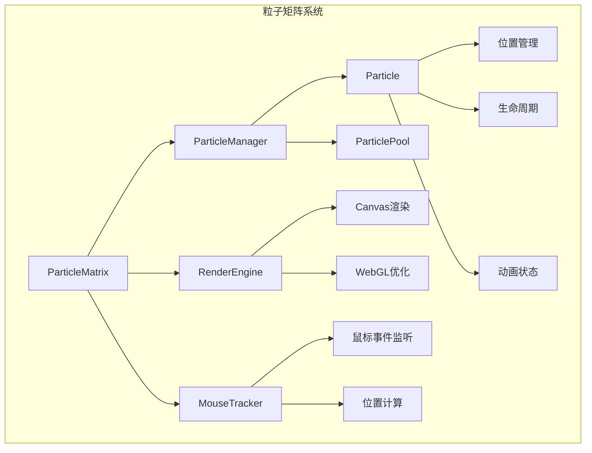
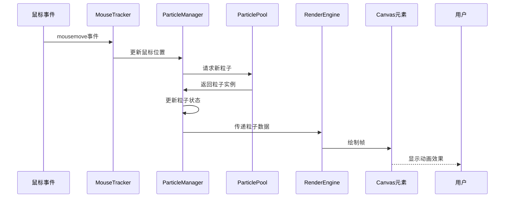

# 粒子矩阵二进制数动画效果分析与实现

## 概述

本文档分析了 https://karot.jiejoe.com/ 网站第一屏页面背景中的粒子矩阵二进制数动画效果，并提供了在当前 Next.js + TypeScript 项目中的完整实现方案。该动画效果包含鼠标交互触发的二进制数字（0 和 1）粒子系统，形成科技感十足的矩阵背景动画。

## 技术栈分析

### 当前项目技术栈

- **框架**: Next.js 15.4.6 + React 19.1.0
- **语言**: TypeScript 5
- **样式**: Tailwind CSS 4
- **动画库**: GSAP 3.13.0
- **其他**: typed.js 2.1.0, Spline 3D

### 目标动画特性

- 粒子系统：动态生成和管理二进制数字粒子
- 鼠标交互：跟随鼠标移动显示粒子轨迹
- 矩阵效果：类似黑客帝国的数字雨效果
- 性能优化：流畅的 60fps 动画表现

## 动画效果架构设计

### 粒子系统核心组件



### 数据流架构



## 核心实现组件

### 1. 粒子类定义

```typescript
interface Particle {
  id: string;
  x: number;
  y: number;
  vx: number;
  vy: number;
  life: number;
  maxLife: number;
  opacity: number;
  size: number;
  char: "0" | "1";
  color: string;
}

class ParticleSystem {
  private particles: Particle[] = [];
  private mouseX: number = 0;
  private mouseY: number = 0;
  private canvas: HTMLCanvasElement;
  private ctx: CanvasRenderingContext2D;

  constructor(canvas: HTMLCanvasElement) {
    this.canvas = canvas;
    this.ctx = canvas.getContext("2d")!;
    this.setupEventListeners();
    this.animate();
  }

  private createParticle(x: number, y: number): Particle {
    return {
      id: Math.random().toString(36).substr(2, 9),
      x: x + (Math.random() - 0.5) * 20,
      y: y + (Math.random() - 0.5) * 20,
      vx: (Math.random() - 0.5) * 2,
      vy: (Math.random() - 0.5) * 2,
      life: 0,
      maxLife: 60 + Math.random() * 120,
      opacity: 1,
      size: 12 + Math.random() * 8,
      char: Math.random() > 0.5 ? "1" : "0",
      color: `hsl(${120 + Math.random() * 60}, 100%, 50%)`,
    };
  }
}
```

### 2. 鼠标跟踪器

```typescript
class MouseTracker {
  private callbacks: Array<(x: number, y: number) => void> = [];
  private lastX: number = 0;
  private lastY: number = 0;
  private threshold: number = 5;

  constructor(element: HTMLElement) {
    element.addEventListener("mousemove", this.handleMouseMove.bind(this));
    element.addEventListener("mouseenter", this.handleMouseEnter.bind(this));
    element.addEventListener("mouseleave", this.handleMouseLeave.bind(this));
  }

  private handleMouseMove(event: MouseEvent): void {
    const deltaX = Math.abs(event.clientX - this.lastX);
    const deltaY = Math.abs(event.clientY - this.lastY);

    if (deltaX > this.threshold || deltaY > this.threshold) {
      this.callbacks.forEach((callback) => {
        callback(event.clientX, event.clientY);
      });

      this.lastX = event.clientX;
      this.lastY = event.clientY;
    }
  }

  public subscribe(callback: (x: number, y: number) => void): void {
    this.callbacks.push(callback);
  }
}
```

### 3. 渲染引擎

```typescript
class RenderEngine {
  private canvas: HTMLCanvasElement;
  private ctx: CanvasRenderingContext2D;
  private pixelRatio: number;

  constructor(canvas: HTMLCanvasElement) {
    this.canvas = canvas;
    this.ctx = canvas.getContext("2d")!;
    this.pixelRatio = window.devicePixelRatio || 1;
    this.setupCanvas();
  }

  private setupCanvas(): void {
    const rect = this.canvas.getBoundingClientRect();
    this.canvas.width = rect.width * this.pixelRatio;
    this.canvas.height = rect.height * this.pixelRatio;
    this.ctx.scale(this.pixelRatio, this.pixelRatio);
    this.canvas.style.width = rect.width + "px";
    this.canvas.style.height = rect.height + "px";
  }

  public renderFrame(particles: Particle[]): void {
    // 清空画布
    this.ctx.clearRect(0, 0, this.canvas.width, this.canvas.height);

    // 设置全局样式
    this.ctx.font = '16px "Courier New", monospace';
    this.ctx.textAlign = "center";
    this.ctx.textBaseline = "middle";

    // 渲染每个粒子
    particles.forEach((particle) => {
      this.renderParticle(particle);
    });
  }

  private renderParticle(particle: Particle): void {
    this.ctx.save();

    // 设置透明度
    this.ctx.globalAlpha = particle.opacity;

    // 设置颜色
    this.ctx.fillStyle = particle.color;
    this.ctx.shadowColor = particle.color;
    this.ctx.shadowBlur = 10;

    // 绘制文字
    this.ctx.fillText(particle.char, particle.x, particle.y);

    this.ctx.restore();
  }
}
```

## React 组件集成

### 主要组件实现

```typescript
"use client";

import React, { useEffect, useRef, useState } from "react";

interface MatrixAnimationProps {
  className?: string;
  intensity?: number;
  colors?: string[];
}

export const MatrixAnimation: React.FC<MatrixAnimationProps> = ({
  className = "",
  intensity = 0.3,
  colors = ["#00ff00", "#00cc00", "#009900"],
}) => {
  const canvasRef = useRef<HTMLCanvasElement>(null);
  const containerRef = useRef<HTMLDivElement>(null);
  const [isLoaded, setIsLoaded] = useState(false);

  useEffect(() => {
    if (!canvasRef.current || !containerRef.current) return;

    const canvas = canvasRef.current;
    const container = containerRef.current;
    const particleSystem = new ParticleSystem(canvas);
    const mouseTracker = new MouseTracker(container);

    // 订阅鼠标移动事件
    mouseTracker.subscribe((x, y) => {
      particleSystem.addParticleAt(x, y);
    });

    setIsLoaded(true);

    return () => {
      particleSystem.destroy();
    };
  }, []);

  return (
    <div
      ref={containerRef}
      className={`relative w-full h-full overflow-hidden ${className}`}
    >
      <canvas
        ref={canvasRef}
        className="absolute inset-0 w-full h-full pointer-events-none"
        style={{
          opacity: isLoaded ? 1 : 0,
          transition: "opacity 0.5s ease-in-out",
        }}
      />
    </div>
  );
};
```

### GSAP 增强动画

```typescript
import { gsap } from "gsap";

class GSAPParticleSystem extends ParticleSystem {
  private timeline: gsap.core.Timeline;

  constructor(canvas: HTMLCanvasElement) {
    super(canvas);
    this.timeline = gsap.timeline({ repeat: -1 });
    this.setupGSAPAnimations();
  }

  private setupGSAPAnimations(): void {
    // 粒子生成动画
    this.timeline.to(
      {},
      {
        duration: 0.1,
        repeat: -1,
        onRepeat: () => {
          this.generateRandomParticles();
        },
      }
    );

    // 全局动画效果
    this.timeline.to(
      this.canvas,
      {
        duration: 2,
        opacity: 0.8,
        ease: "power2.inOut",
        yoyo: true,
        repeat: -1,
      },
      0
    );
  }

  public animateParticleEntrance(particle: Particle): void {
    gsap.fromTo(
      particle,
      {
        opacity: 0,
        size: 0,
      },
      {
        opacity: 1,
        size: particle.size,
        duration: 0.3,
        ease: "back.out(1.7)",
      }
    );
  }

  public animateParticleExit(particle: Particle): void {
    gsap.to(particle, {
      opacity: 0,
      size: 0,
      duration: 0.5,
      ease: "power2.in",
      onComplete: () => {
        this.removeParticle(particle.id);
      },
    });
  }
}
```

## 性能优化策略

### 1. 对象池模式

```typescript
class ParticlePool {
  private pool: Particle[] = [];
  private active: Particle[] = [];
  private maxPoolSize: number = 200;

  public getParticle(): Particle {
    if (this.pool.length > 0) {
      return this.pool.pop()!;
    }
    return this.createNewParticle();
  }

  public releaseParticle(particle: Particle): void {
    if (this.pool.length < this.maxPoolSize) {
      this.resetParticle(particle);
      this.pool.push(particle);
    }
  }

  private resetParticle(particle: Particle): void {
    particle.life = 0;
    particle.opacity = 1;
    particle.x = 0;
    particle.y = 0;
    particle.vx = 0;
    particle.vy = 0;
  }
}
```

### 2. 帧率控制

```typescript
class AnimationController {
  private fps: number = 60;
  private fpsInterval: number = 1000 / this.fps;
  private lastTime: number = 0;
  private rafId: number = 0;

  public startAnimation(callback: () => void): void {
    this.lastTime = performance.now();
    this.animate(callback);
  }

  private animate(callback: () => void): void {
    this.rafId = requestAnimationFrame(() => {
      const currentTime = performance.now();
      const elapsed = currentTime - this.lastTime;

      if (elapsed >= this.fpsInterval) {
        callback();
        this.lastTime = currentTime - (elapsed % this.fpsInterval);
      }

      this.animate(callback);
    });
  }

  public stopAnimation(): void {
    if (this.rafId) {
      cancelAnimationFrame(this.rafId);
    }
  }
}
```

### 3. 内存管理

```typescript
class MemoryManager {
  private maxParticles: number = 150;
  private cleanupThreshold: number = 200;

  public shouldCleanup(particleCount: number): boolean {
    return particleCount > this.cleanupThreshold;
  }

  public cleanupOldParticles(particles: Particle[]): Particle[] {
    if (particles.length <= this.maxParticles) {
      return particles;
    }

    // 按生命周期排序，移除最老的粒子
    particles.sort((a, b) => b.life - a.life);
    return particles.slice(0, this.maxParticles);
  }
}
```

## 响应式设计适配

### 设备适配策略

```typescript
class ResponsiveAdapter {
  private breakpoints = {
    mobile: 768,
    tablet: 1024,
    desktop: 1440,
  };

  public getDeviceConfig(): DeviceConfig {
    const width = window.innerWidth;

    if (width < this.breakpoints.mobile) {
      return {
        maxParticles: 50,
        particleSize: 10,
        animationIntensity: 0.2,
      };
    } else if (width < this.breakpoints.tablet) {
      return {
        maxParticles: 100,
        particleSize: 12,
        animationIntensity: 0.3,
      };
    } else {
      return {
        maxParticles: 150,
        particleSize: 14,
        animationIntensity: 0.5,
      };
    }
  }

  public setupResponsiveCanvas(canvas: HTMLCanvasElement): void {
    const resizeHandler = () => {
      const container = canvas.parentElement;
      if (container) {
        canvas.style.width = container.clientWidth + "px";
        canvas.style.height = container.clientHeight + "px";
        canvas.width = container.clientWidth * window.devicePixelRatio;
        canvas.height = container.clientHeight * window.devicePixelRatio;
      }
    };

    window.addEventListener("resize", resizeHandler);
    resizeHandler(); // 初始化
  }
}

interface DeviceConfig {
  maxParticles: number;
  particleSize: number;
  animationIntensity: number;
}
```

## 集成到现有项目

### 1. 页面组件集成

```typescript
// src/components/background/MatrixBackground.tsx
"use client";

import React from "react";
import { MatrixAnimation } from "./MatrixAnimation";

export const MatrixBackground: React.FC = () => {
  return (
    <div className="fixed inset-0 z-0 pointer-events-none">
      <MatrixAnimation
        className="w-full h-full"
        intensity={0.4}
        colors={["#00ff41", "#00d235", "#00b429"]}
      />
    </div>
  );
};
```

### 2. 主页面引入

```typescript
// src/app/page.tsx
import { MatrixBackground } from "@/components/background/MatrixBackground";

export default function Home() {
  return (
    <main className="relative min-h-screen">
      <MatrixBackground />

      <div className="relative z-10">
        {/* 现有页面内容 */}
        <section className="h-screen flex items-center justify-center">
          <h1 className="text-4xl font-bold animate-slide-right delay-1s">
            Call Me Derwyn
          </h1>
        </section>
      </div>
    </main>
  );
}
```

### 3. 样式优化

```css
/* src/app/globals.css 中添加 */
.matrix-container {
  background: radial-gradient(
    ellipse at center,
    rgba(0, 20, 0, 0.1) 0%,
    rgba(0, 0, 0, 0.9) 100%
  );
}

.particle-glow {
  filter: drop-shadow(0 0 6px currentColor);
}

@media (prefers-reduced-motion: reduce) {
  .matrix-animation {
    animation: none;
    opacity: 0.3;
  }
}
```

## 浏览器兼容性

### 支持的浏览器

| 浏览器  | 最低版本 | Canvas 支持 | Performance API |
| ------- | -------- | ----------- | --------------- |
| Chrome  | 60+      | ✅          | ✅              |
| Firefox | 55+      | ✅          | ✅              |
| Safari  | 12+      | ✅          | ✅              |
| Edge    | 79+      | ✅          | ✅              |

### 降级策略

```typescript
class FeatureDetector {
  public static canUseCanvas(): boolean {
    const canvas = document.createElement("canvas");
    return !!(canvas.getContext && canvas.getContext("2d"));
  }

  public static canUseRAF(): boolean {
    return typeof requestAnimationFrame !== "undefined";
  }

  public static hasGoodPerformance(): boolean {
    return navigator.hardwareConcurrency > 2 && window.devicePixelRatio <= 2;
  }

  public static shouldUseAnimation(): boolean {
    return (
      this.canUseCanvas() &&
      this.canUseRAF() &&
      !window.matchMedia("(prefers-reduced-motion: reduce)").matches
    );
  }
}
```

## 测试策略

### 单元测试

```typescript
// __tests__/ParticleSystem.test.ts
import { ParticleSystem } from "../src/components/background/ParticleSystem";

describe("ParticleSystem", () => {
  let canvas: HTMLCanvasElement;
  let particleSystem: ParticleSystem;

  beforeEach(() => {
    canvas = document.createElement("canvas");
    canvas.width = 800;
    canvas.height = 600;
    particleSystem = new ParticleSystem(canvas);
  });

  test("应该创建粒子实例", () => {
    expect(particleSystem).toBeInstanceOf(ParticleSystem);
  });

  test("应该正确添加粒子", () => {
    const initialCount = particleSystem.getParticleCount();
    particleSystem.addParticleAt(100, 100);
    expect(particleSystem.getParticleCount()).toBe(initialCount + 1);
  });

  test("应该正确移除过期粒子", () => {
    particleSystem.addParticleAt(100, 100);
    particleSystem.updateParticles();
    // 模拟多次更新直到粒子过期
    for (let i = 0; i < 200; i++) {
      particleSystem.updateParticles();
    }
    expect(particleSystem.getParticleCount()).toBe(0);
  });
});
```

### 性能测试

```typescript
// __tests__/Performance.test.ts
describe("动画性能测试", () => {
  test("应该在指定时间内完成渲染", async () => {
    const canvas = document.createElement("canvas");
    const particleSystem = new ParticleSystem(canvas);

    // 添加大量粒子
    for (let i = 0; i < 100; i++) {
      particleSystem.addParticleAt(Math.random() * 800, Math.random() * 600);
    }

    const startTime = performance.now();
    particleSystem.render();
    const endTime = performance.now();

    expect(endTime - startTime).toBeLessThan(16); // 应该在16ms内完成
  });
});
```
